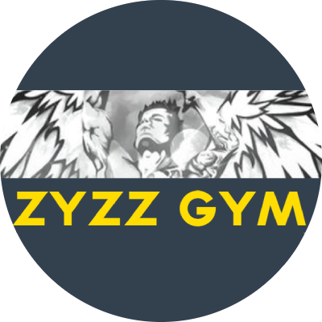
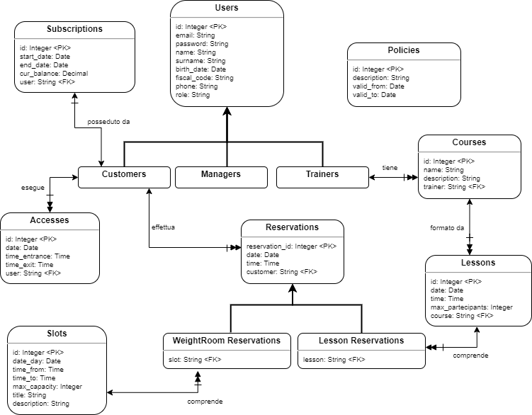
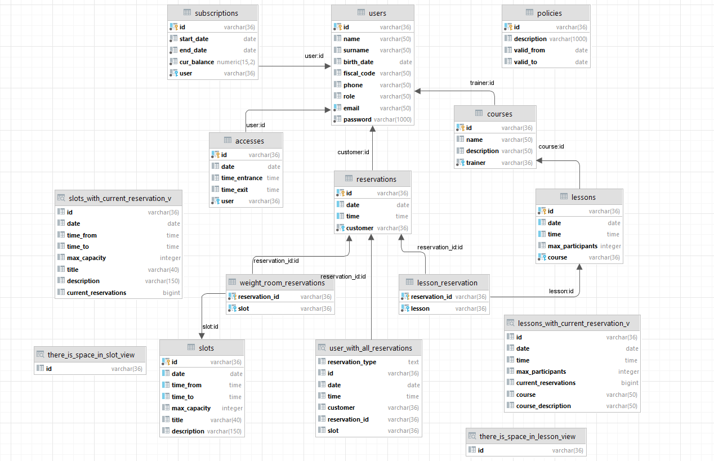

<div id="top"></div>

[![LinkedIn][linkedin-shield]][linkedin-url]

<!-- PROJECT LOGO -->
<div align="center">
    

  <h1 align="center">Gym App</h3>
</div>

<!-- TABLE OF CONTENTS -->
<details>
  <summary>Table of Contents</summary>
  <ol>
    <li>
      <a href="#about-the-project">About The Project</a>
      <ul>
        <li><a href="#built-with">Built With</a></li>
      </ul>
    </li>
    <li>
      <a href="#getting-started">Getting Started</a>
      <ul>
        <li><a href="#prerequisites">Prerequisites</a></li>
          <li><a href="#setup1">Setup PostgreSQL</a></li>
          <li><a href="#setup2">Setup Flask Application</a></li>
      </ul>
    </li>
    <li><a href="#usage">Usage</a></li>
    <li><a href="#contributing">Contributing</a></li>
    <li><a href="#demo">Demo</a></li>
  </ol>
</details>


<!-- ABOUT THE PROJECT -->
## About The Project


![Product Name Screen Shot][product-screenshot]
<div align="center" ><a href="#demo">Demo</a> </div>
[Documentation](https://github.com/ambrosdavid/GymApp/blob/main/Italian%20Documentation.pdf)_ (WIP)

"GymApp" is a university project related to the "Databases" course created for the purpose of managing a gym during the covid-19 period, via an online booking system, completely built from scratch.

Respectively for front-end, back-end and database the following tools have been used:
* __Front-end:__ The Angular 13 framework was used.
* __Back-End:__ Python, Flask and SQLAlchemy were used.
* __Database:__ PostgreSQL

In addition, __Docker__ was used to manage containers running the processes: Flask-App (back-end) and PosgreSQL database, in isolated environments!

This is a really basic project based on a single postgreSQL database which is connected from a single flask rest-applications server which in turn communicates with the basic front-end webpage.
The purpose of this project is also to dockerize as much as possible, in order to, after-all enable a easy blue-red pipeline for CI/CD scope.

### Built With


* [Angular](https://angular.io/)
* [Python](https://www.python.org/)
* [PostgreSQL](https://www.postgresql.org/)
* [Bulma](https://bulma.io/)
* [Flask](https://flask.palletsprojects.com/en/2.0.x/)
* [SQLAlchemy](https://flask-sqlalchemy.palletsprojects.com/en/2.x/)
* [Docker](https://www.docker.com/)
* [Docker-Compose](https://docs.docker.com/compose/)


<!-- GETTING STARTED -->
## Getting Started

To get a local copy up and running follow these simple example steps.

### Prerequisites

1. You should have installed Docker [here](https://docs.docker.com/get-docker/) in your local machine.

2. And also docker-compose [here](https://docs.docker.com/compose/install/).

3. Before proceeding with the build and run of the project be carefull on setting correctly the POSTGRES_HOST env variable inside the Dockerfile file.

4. In order to set it correctly check your own local machine ip, and set it as you see.


### Setup PostgreSQL(docker)
<div id="setup1"></div>

>Command line for the PostgreSQL docker container : 

* In the same folder of docker-compose.yml run : 
    ```sh
    docker-compose up -d
    ```

* To see the image and container you just created :
    ```sh
    docker image ls
    docker ps
    ```
### Setup Flask Application(docker)
<div id="setup2"></div>

>Command list for the Flask docker container : 

* In the same folder of the Dockerfile run :

    ```
    docker build -t flask:0.1 .
    docker run -dit -p 5000:5000 flask:0.1
    docker container logs -f {id}
    ```


<!-- USAGE EXAMPLES -->
## Usage

Now you can interact with the rest-application server with Postman, for example : 
```
curl --location --request POST 'http://127.0.0.1:5000/add' \
--header 'Content-Type: application/json' \
--data-raw '{
    "name" : "Ivan",
    "price" : 3000,
    "breed" : "type"
}'
```

```
curl --location --request GET 'localhost:5000/'
```
_For more examples, please refer to the (work in progress) [Documentation](https://github.com/ambrosdavid/GymApp/blob/main/Italian%20Documentation.pdf)_


<!-- CONTRIBUTING -->
## Contributing

Contributions are what make the open source community such an amazing place to learn, inspire, and create. Any contributions you make are **greatly appreciated**.

If you have a suggestion that would make this better, please fork the repo and create a pull request. You can also simply open an issue with the tag "enhancement".
Don't forget to give the project a star! Thanks again!

1. Fork the Project
2. Create your Feature Branch (`git checkout -b feature/AmazingFeature`)
3. Commit your Changes (`git commit -m 'Add some AmazingFeature'`)
4. Push to the Branch (`git push origin feature/AmazingFeature`)
5. Open a Pull Request


## Demo

<div id="demo"></div>

<div align="center">
    <h4> Gym web app:</h4>
    
    <br>
    <h4> Object diagram:</h4>
    
<br>
    <h4> ER diagram:</h4>
    

    
<p>(<a href="#top">back to top</a>)</p>
</div>


<!-- MARKDOWN LINKS & IMAGES -->
<!-- https://www.markdownguide.org/basic-syntax/#reference-style-links -->
[linkedin-shield]: https://img.shields.io/badge/-LinkedIn-black.svg?style=for-the-badge&logo=linkedin&colorB=555
[linkedin-url]: https://www.linkedin.com/in/david-ambros-07404a174/
[product-screenshot]: images/fe.PNG
